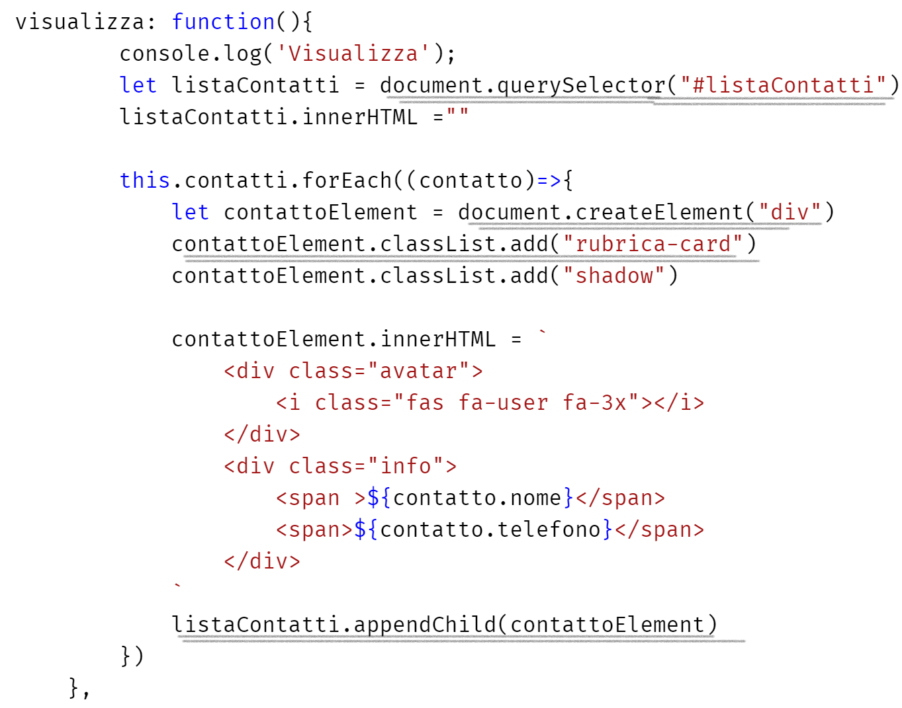
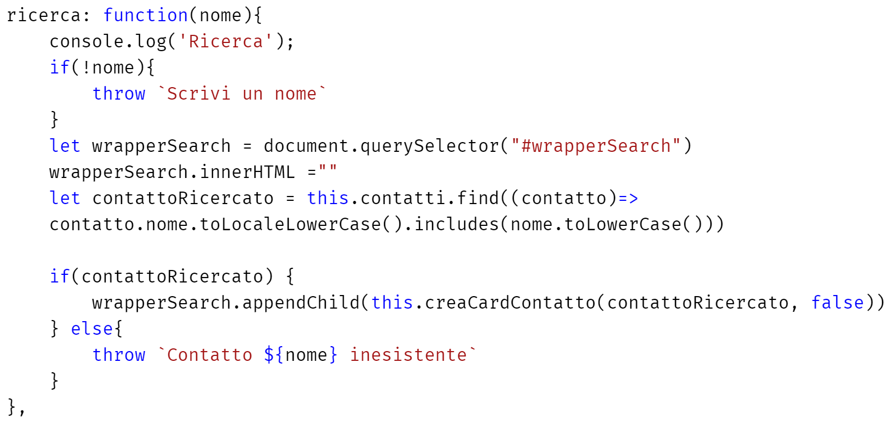
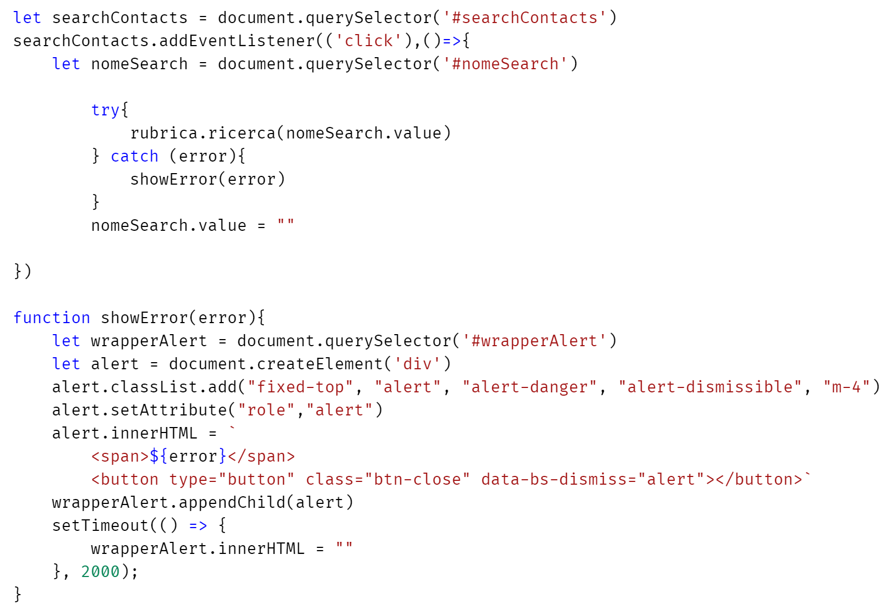

### Manipolazione del DOM

#### 1. _HTML_

#### 2. _Astrazione card JS_

#### 3. Funzione Ricerca con _thorw_ errori e metodo _filter_

#### 4. Evento Ricerca con blocco _try-catch_ e _timeout_

&nbsp;
